# 魂游 MOD 翻译工具文档

> 文档是为 MOD 翻译者准备的，内部包含了较多的技术和使用细节，如果您只是想简单地机翻一个 MOD，那么您可以到此结束，请直接去看[这个视频](https://www.bilibili.com/video/BV17p421Q7qJ/)即可。

## 软件工作流

下图展示了软件的基本工作流。

简单来说，软件首先通过对照中英数据库的方式找到所有的新文本（相关技术细节见附件），紧接着基于术语表对新文本做预处理（可选），然后将预处理后的中英夹杂的新文本到处为Excel或者txt格式。最后，软件将翻译者使用谷歌或人工翻译的方式将新文本和之前产生的已翻译文本合并为新的语言文件并写入磁盘。




## 数据库

中英数据库是用来对照的,它是一个键值对集合,键是英文文本，值是对应的中文文本翻译。软件提供了基于已有中英语言文件导出数据库的功能。位于"工具"一栏中。此外，软件默认提供了原版数据库，位于db目录中，软件会在启动时自动读取该目录的所有数据库文本。最后，需要注意的是**数据库的核心是提供中英对照功能和替换的功能，翻译者可以基于MOD已有的翻译来导出自定义数据库以达到增量翻译的效果**。


## 技术细节

### 文本的切分和编号

对于FS游戏中的语言文件(.msgbnd.dcx文件),其内部是树状组织的,一条完整的文本可以由`类型_ID`来表示，其中类型是ASCII字符串，如WeaponName，WeaponCaption等。ID是一串长数字，标识了该条文本在其类型内的ID。例如，"石剑钥匙"这一物品的文本描述为：

```
参考剑的外型设计的石制钥匙。

能解开小恶魔像的封印。
使用后会插在雕像上，从置物包消失。

建议慎选使用时机。
```

其文本类型是`GoodsCaption`,文本ID是8000。

因此，翻译软件会根据这一索引为每一条文本设置基本的UID。另外，为了尽量利用原版文本，软件还会在每条文本内部进行进一步的切分，即**为每条文本内的每一个段落和每一行分配各自的ID**。还是以上述文本为例，下表列出了每一句话的ID。

| 段落（句子）                                                 | 文本内ID |
| ------------------------------------------------------------ | -------- |
| 参考剑的外型设计的石制钥匙。                                 | 1        |
| 能解开小恶魔像的封印。<br/>使用后会插在雕像上，从置物包消失。 | 2        |
| 能解开小恶魔像的封印。                                       | 21       |
| 使用后会插在雕像上，从置物包消失。                           | 22       |
| 建议慎选使用时机。                                           | 3        |

**段落被分配的ID永远是1~9之间的一个数字，而段落内每句话被分配的ID永远是11~99中间的一个数字（所有索引以1开头，不含整除10的数字）**，因此软件无法处理超过9段话的文本以及超过9行的句子。

句子的文本内ID和文本ID"类型_ID"一同构成了文本的唯一ID。

